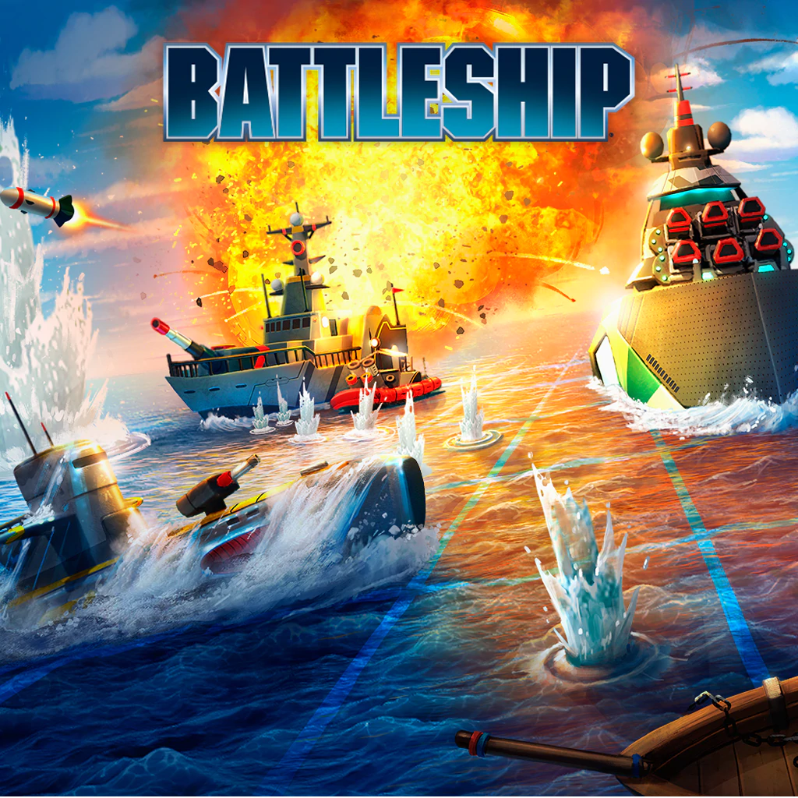

Este proyecto ha sido desarrollado durante el bootcamp de ***TheBridge Data Science enero 2021***.\
Es un programa realizado en Python del conocido juego de hundir la flota en el que se han creado 2 scripts: utils (script para describir las funciones) y main (script de ejecución del programa) en el IDE Pycharm. 
\
\
**Recursos**\
IDE de Python Pycharm\
[Imagen de la portada](https://image.api.playstation.com/cdn/UP0001/CUSA04275_00/AGKmSWwlJbRZIq53oPoPUwmjzonedVtO.png)
\
[Imagen del barco en pycharm](http://arteascii.yaia.com/transportes.html)
\
\
**Librerías**\
Numpy\
Random\
\
**Autores**\
Alberto Lara \
Sonia Dosio